# **Traffic Sign Recognition** 

The goal of this project is to classify German Traffic Signs.  The dataset can be found [here](https://d17h27t6h515a5.cloudfront.net/topher/2017/February/5898cd6f_traffic-signs-data/traffic-signs-data.zip).  There are 43 categories 
of traffic signs.  

Our main code is contained in two files [augment_data.py](./augment_data.py) and [layers.py](./layers.py).  The program `augment_data.py` creates an enlarged data set by adding versions of signs flipped horizontally, vertically, diagonally, etc. if such transformations change the sign into another valid sign.  This program enlarges the dataset from 34799 images to 67198 images.

The file `layers.py` contains our preprocessing steps, model definition, and trains the model.

We also include an html version of a [jupyter notebook](./Traffic_Sign_Classifier.html) with all the steps of our process.

## Rubric Points

### Data Set Summary & Exploration

The code for this step is contained in the third code cell of the IPython notebook.  

* The size of training set is 34799
* The size of test set is 12630
* The shape of a traffic sign image is (32,32,3)
* The number of unique classes/labels in the data set is 43

#### Exploratory visualization of the dataset.

The code for this step is contained in the fourth code cell of the IPython notebook.  Here are examples of all the sign types in the data set:
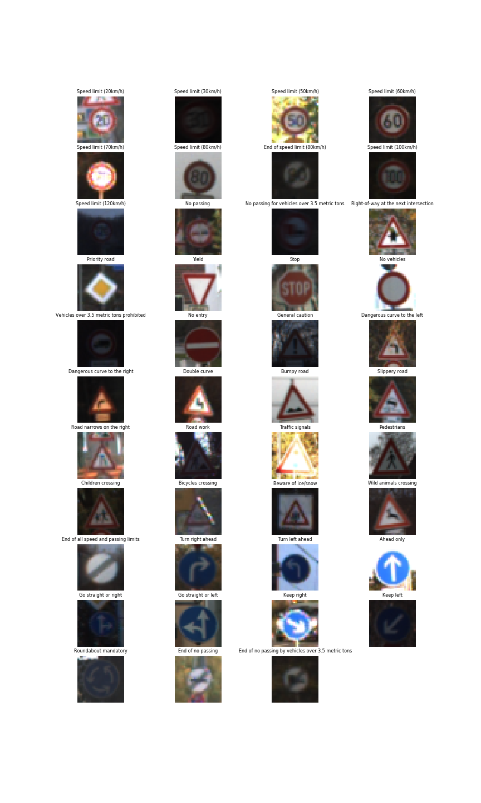

From a survey of the dataset, we made a few observations.

1) Some images are very dark:

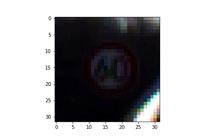

2) Some images are very similar.  I believe this is because the dataset images were captured from video.

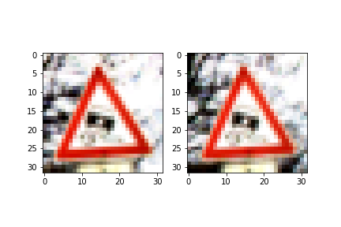

3) The dataset is highly unbalanced.  Here is a histogram of the number of examples in the training set from each of the 43 categories:

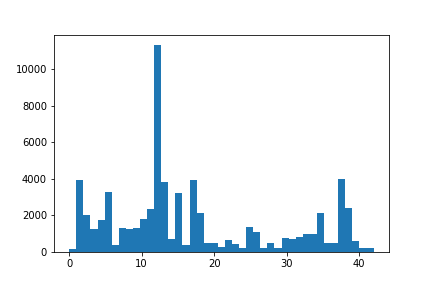

#### Preprocessing.
From the data exploration, one potential difficulty we identified was the lack of contrast in some images.  We then explored preprocessing options to enhance contrast.  We looked at 4 different [techniques](http://scikit-image.org/docs/0.9.x/auto_examples/plot_equalize.html) from the skimage package in code cell 9:

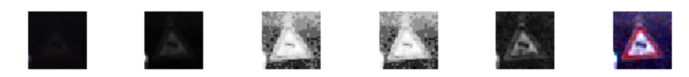

The first image is the original color image.  The second is the original image in grayscale.  This already is slightly more recognizable.

The third image uses local histogram equalization, the fourth global histogram equalization, and the fifth adaptive histogram equalization.  Finally, the sixth does [contrast stretching](http://homepages.inf.ed.ac.uk/rbf/HIPR2/stretch.htm): it rescales the 2nd to 98th percentile range of pixel intensities to use the full range 0-255.  

I liked the results of contrast stretching the most, and used this to preprocess the images.

After contrast stretching, we just did the simple transformation 
`img = img/255.0 - 0.5`, to scale and center the data around 0.

#### Data Augmentation

As described above, we enlarged the data set by flipping images vertically, horizontally, diagonally, etc. if doing so resulted in another meaningful sign.  This enlarged the dataset to 67198.  We also created an "infinite" data set as in each epoch we randomly perturbed every image in the training set: we randomly rotated it up to 10 degrees, translated it, rescaled it, added perspective distortion, and modified the brightness.  This is done in the `jitter` function in cell 23.

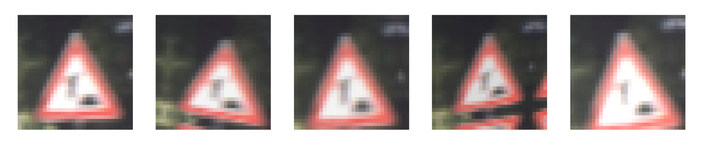

### Model Architecture

The code for my final model is located in cell 62 of the notebook.  We used a VGG style network with blocks consisting of two applications of 3x3 convolutions.  We used three such convolutional blocks before the fully 
connected layer.  We also use the idea from the paper of Sermanet and LeCun of feeding the output of each convolutional block into the fully connected layer.  

Finally, we use a 1x1 convolutional layer at the beginning to learn a color transformation from RGB into a single channel.  This gave about a 0.5% performance boost over using RGB images.

My final model consisted of the following layers:

| Layer         		|     Description	        					| 
|:---------------------:|:---------------------------------------------:| 
| Input         		| 32x32x3 RGB image   							| 
| 1x1 Convolution      	| 32x32x1 image 	|
| Conv Block 1			| 32x32x32 image												|
| 2x2 Max pooling	    | 16x16x32				|
| Conv Block 2	        | 16x16x64      									|
| 2x2 Max pooling		| 8x8x64        								|
| Conv Block 3			| 8x8x128      									|
| 2x2 Max pooling		| 4x4x128										|
| Pool, flatten, concatenate blocks |	3584x1	|
| dropout 				| keep prob = 0.5 |
| Fully connected layer | 512x1
| dropout               | keep prob = 0.5
| Fully connected layer | 43x1 |
| Softmax               |
 

#### 4. Training of the model

The code for training the model is located in cells 63 and 24 of the notebook. 

To train the model, we used the Adam Optimizer with a rate of 0.001.  We saved the model after every epoch that achieved a new low in the validation cross entropy.  After 20 epochs with no improvement in validation cross entropy we stopped the training.  The best validation cross entropy was achieved in epoch 13.

The final model results were:
* training set accuracy of 98.86
* validation set accuracy of 99.46 
* test set accuracy of 98.08

It is interesting that the validation accuracy is actually higher than the test set accuracy.  We attribute this to the fact that the test images are randomly perturbed with each epoch.

In our experiments we noticed that continuing to train the best saved model using the Adam Optimizer with a lower rate of 0.0001 resulted in improved performance and we achieved a test set accuracy of 98.43% in this way.  This is not included in the notebook, however. 

#### 5. The approach taken for finding a solution. 

We began with the LeNet model.  It generalized well, but the training accuracy was not very high, thus we looked for a more powerful model.  We went to 3 convolutional blocks and also increased the number of filters in each block.  Based on the Sermanet and LeCun paper, we also fed all outputs from the convolutional blocks into the fully connected layer.  We then experimented with dropout in this model, and found it to improve performance.  We also found an initial 1x1 convolutional layer to map the RGB image to a single channel improved performance.  In the dense layer we settled with 512 neurons as this was better than 256 and 1024 did not seem to give improvement.  We also experimented with adding a second dense layer, but this did not yield improvement.  

In the future we would like to experiment with adding batch norm as well.

 

### Test Model on New Images

Here are six traffic signs that I found on the web:

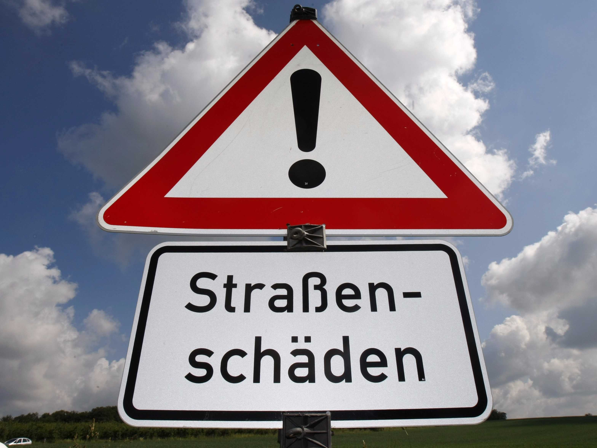

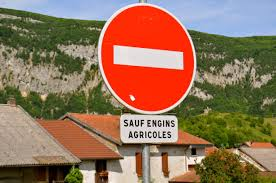

The analysis of these traffic signs begins from cell 19 in the notebook.

Here are the results of the predictions:

| Image			        |     Prediction	        					| 
|:---------------------:|:---------------------------------------------:| 
| General Caution      	| Slippery road   									| 
|Right-of-way at the next intersection|Right-of-way at the next intersection|
| Slippery Road			| Dangerous curve to the left											|
| Bumpy Road	      		| Bumpy Road					 				|
| Stop			          | Stop      						        	|
| No entry             | No entry

The model was correct on 4 of the 6 new images.  

We can see the confidence of the model in its predictions by looking at the top 5 probabilities for each sign.

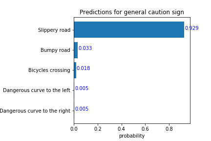
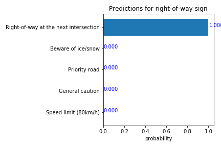
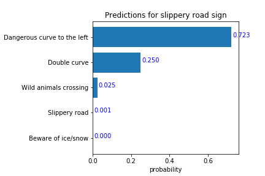
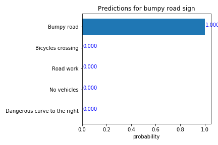
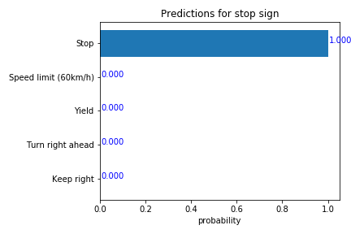
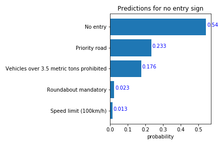

The model is very confident in the (correct) predictions for the right-of-way sign, the bumpy road sign, and the stop sign.  For the slippery road sign, the algorithm mistakenly thought it was a dangerous curve to the left, but at least slippery road was in the top 5 predictions.

## Visualizations

From cell 16 in the notebook, we visualize the outputs of the first 3x3 convolutional block of the network.  We can see strong gradients on the borders of the circular and triangular signs, and to a lesser extent to the content of the sign as well.  Here is an example of some the filter activations.

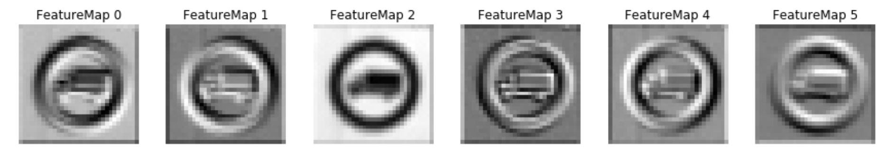

Finally, from cell 59 we looked at average activations (after ReLu) of the first and second 3x3 convolutions over all images in the test set.  We can see that there are a few filters that are hardly ever activated.  It was interesting to me that this occurred at a filter level---i.e., if a filter was active in a certain region of an image, it was generally active to some degree throughout the image.  On the other hand, there were some "dud" filters that were essentially inactive everywhere for all images.  Here is an example of a filter in the second 3x3 convolutional layer that is hardly ever active (the image represents the average activation over all test images).

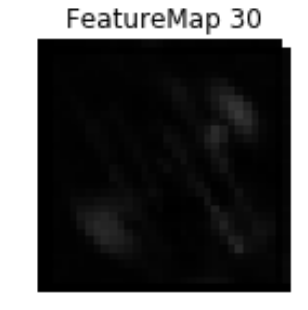